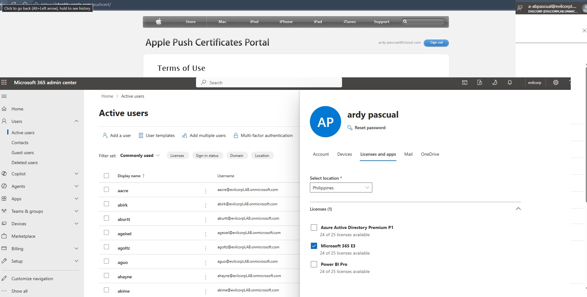
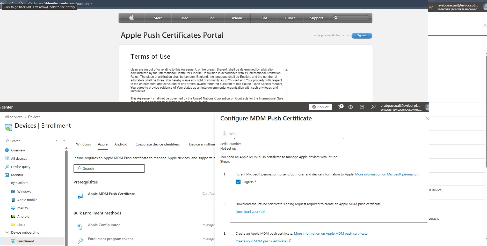
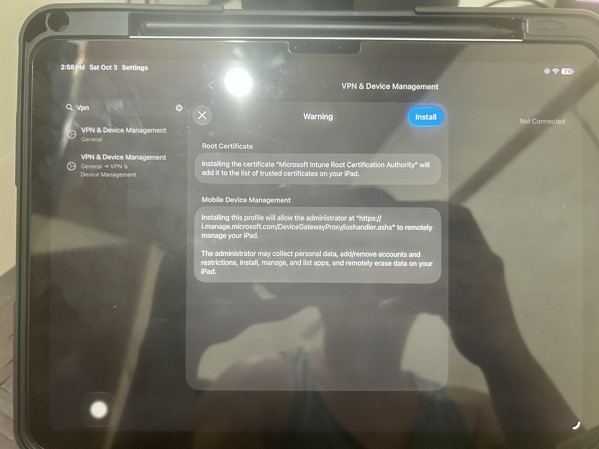
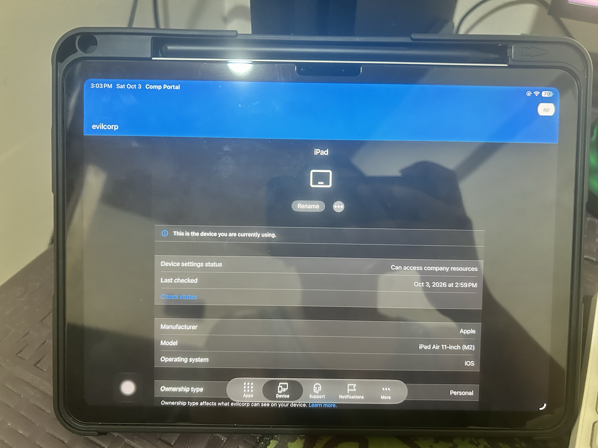
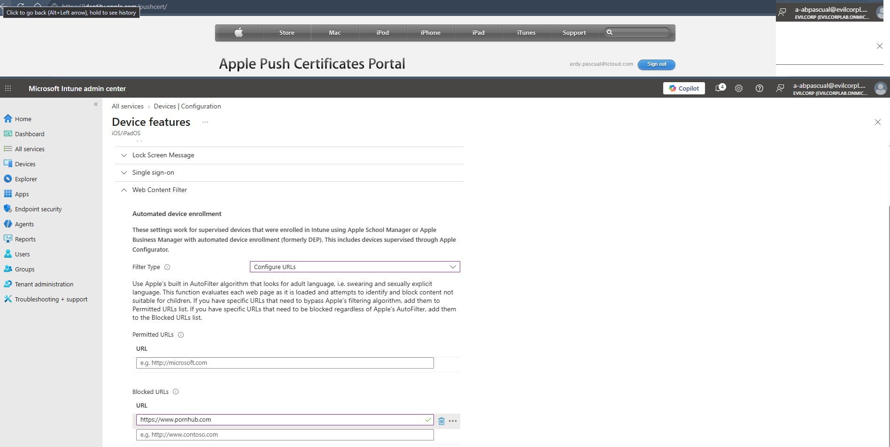
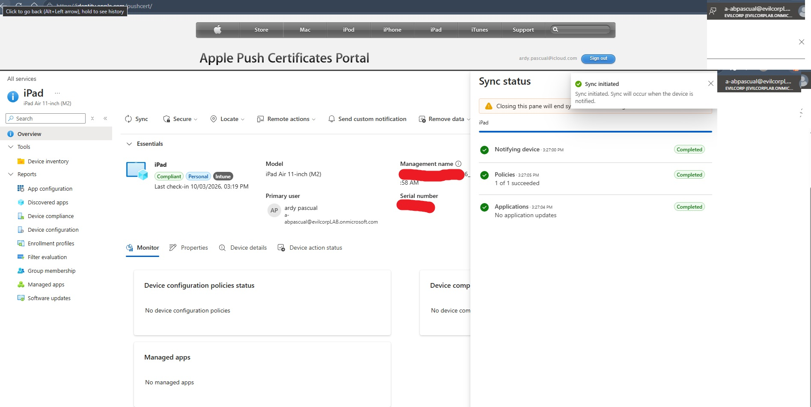
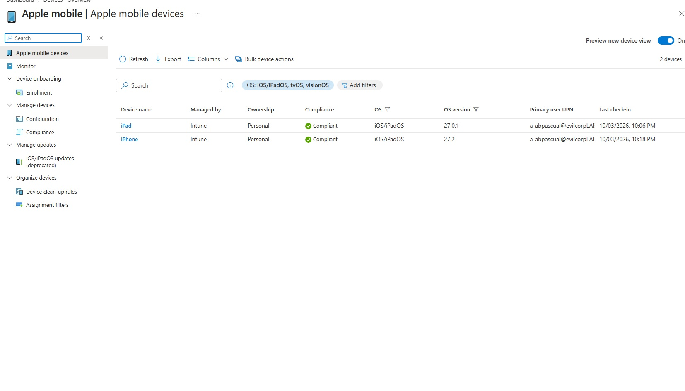
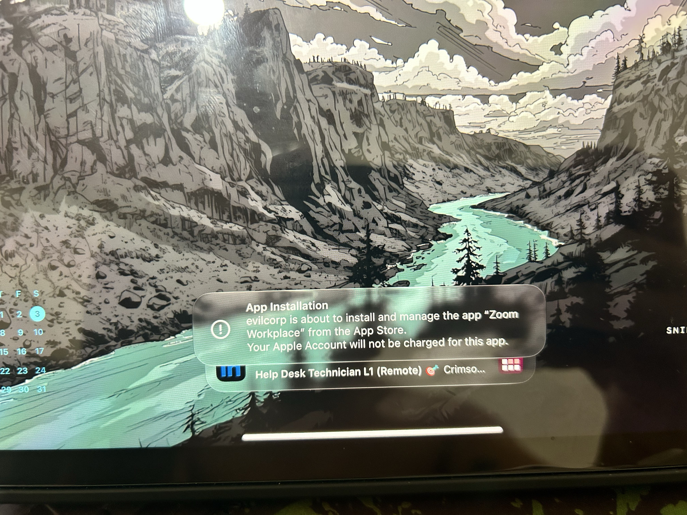
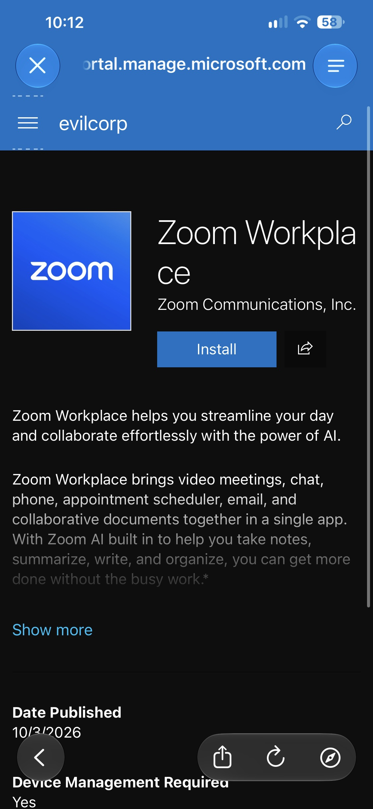

# 🚀 Building an Enterprise Mobile Device Management (MDM) Lab with Microsoft Intune & Apple iOS

Today, I built and configured a complete cloud-based endpoint management workflow using **Microsoft Intune** and an **Apple iPad**. This project covers everything from tenant licensing and Apple Push Certificate generation to device enrollment and web filtering restrictions.

---

## 🛠️ Phase 1: Tenant Setup & Licensing
Before configuring any device policies, the cloud environment requires appropriate enterprise management licenses and MDM authority assignments.
* **Microsoft 365 E3 License Allocation:** Assigned an **M365 E3** license to administrative and test accounts (e.g., `ardypascual@evilcorpLAB.onmicrosoft.com`) to unlock full Intune endpoint management capabilities[cite: 19].
* **Automatic MDM Enrollment:** Configured Microsoft Entra ID automatic enrollment scopes (`All` users) so that corporate devices seamlessly bind to the organization upon sign-in[cite: 18].

| Component | Status | Details |
| :--- | :--- | :--- |
| **Tenant** | Active | `evilcorpLAB.onmicrosoft.com`[cite: 19] |
| **License** | Assigned | Microsoft 365 E3 (Includes Intune P1)[cite: 19] |
| **MDM Authority** | Configured | Microsoft Intune |

---

## 🍏 Phase 2: Apple Push Certificate (APNs) Integration
Apple requires an MDM Push Certificate to securely communicate with iOS devices through Apple’s Push Notification service.
1. **CSR Generation:** Downloaded the Intune Certificate Signing Request (CSR) directly from the Microsoft Intune Admin Center under **Devices > Enrollment > Apple**[cite: 22].
2. **Apple Push Certificates Portal:** Uploaded the CSR to Apple's portal after accepting the terms of use[cite: 21].
3. **PEM/DER Handshake:** Generated and downloaded the signed `.pem` certificate from Apple and uploaded it back to Intune to establish the secure push connection.

---

## 📱 Phase 3: iOS Device Onboarding & Enrollment
With APNs active, an iPad was enrolled into the Intune ecosystem via the Company Portal.
* **Management Profile Installation:** Pushed the **Microsoft Intune Root Certification Authority** and MDM profile to the iPad (`iPad Air 11-inch M2`), establishing trusted remote management[cite: 16, 17, 20].
* **Company Portal Verification:** Verified device check-in, compliance status, and ownership tagging inside the Microsoft Intune dashboard[cite: 17, 20].

---

## 🔒 Phase 4: Device Restrictions & Content Filtering
To enforce corporate security standards, a custom device configuration policy was deployed to restrict unauthorized web traffic on the iPad.
* **iOS Device Restriction Policy:** Created a profile named `IOS DEVICE RESTRICTION POLICY` targeting iOS/iPadOS platforms[cite: 14].
* **Web Content Filter:** Configured automated adult content filtering alongside explicit URL blocking (e.g., restricting prohibited domains like `pornhub.com`)[cite: 13].
* **Policy Sync Verification:** Triggered a remote device sync from the Intune admin console, confirming a successful `1 of 1 succeeded` policy deployment status on the target iPad[cite: 20].

---

## 📸 Lab Gallery

* **Licensing Setup:**  
  [cite: 19]

* **Apple Push Certificate Portal:**  
  [cite: 21]

* **MDM Push Configuration:**  
  [cite: 22]

* **iOS Root Certificate & Profile Prompt:**  
  [cite: 16]

* **Company Portal Enrollment Success:**  
  [cite: 17]

* **Creating the Device Restriction Policy:**  
  [cite: 14]

* **Configuring URL Blocking:**  
  [cite: 13]

* **Successful Policy Sync:**  
  [cite: 20]

---

### Lab Milestone: Mobile Device Management & Application Deployment (iOS/iPadOS)

Successfully orchestrated and validated mobile device management capabilities within the `evilcorpLAB.onmicrosoft.com` tenant, focusing on user-targeted deployments and iOS lifecycle management.

* **Tenant & Infrastructure Configuration:** 
  - Configured Apple Push Notification service (APNs) integration to establish secure communication between Microsoft Intune and Apple mobile devices.
  - Enrolled personal (unsupervised) iOS and iPadOS devices under test user accounts.
* **Security & Device Policies:**
  - Deployed iOS Device Restriction policies incorporating web filtering capabilities.
* **App Deployment & Lifecycle Management:**
  - Targeted and successfully deployed required productivity applications (including Zoom Workplace for Intune) to user groups (`IPAD USERS`).
  - Validated the native iOS MDM prompt behavior for personal, unsupervised devices requiring user interaction.
  - Verified remote device actions, bulk synchronization commands, and device check-in reporting via the Intune Admin Center and Company Portal apps.

   * **Enrolled Device Inventory & Compliance Status:**
  

* **Native iOS MDM App Installation Prompt:**
  

* **Company Portal Web View & Deployment Status:**
  

### 💡 Key Takeaways
This lab demonstrates the power of modern cloud endpoint management, highlighting how quickly an administrator can provision security baselines, establish trust with Apple's push infrastructure, and enforce corporate compliance across mobile endpoints.
